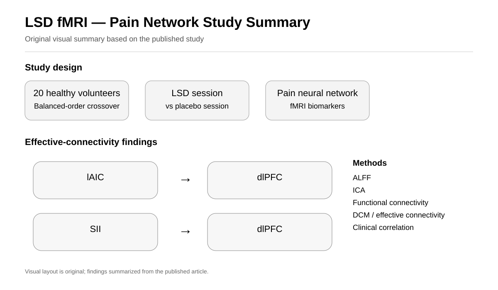

# fMRI-Insula-Brain-Connectivity

## Clinical Utility of fMRI in Evaluating of LSD Effect on Pain-Related Brain Networks in Healthy Subjects



*Original visual summary based on the published study.*

This repository presents a research project investigating the effects of LSD on pain-related brain networks in healthy participants using functional magnetic resonance imaging (fMRI).

The study focused on changes in brain activity, functional connectivity, and effective connectivity associated with pain processing following LSD administration.

## Research Question

How does LSD affect pain-related brain networks and functional and effective connectivity in healthy participants?

## Study Focus

- Pain processing
- LSD
- Functional magnetic resonance imaging (fMRI)
- Pain-related brain networks
- Functional connectivity
- Effective connectivity
- Dynamic causal modeling (DCM)
- Brain network analysis

## Study Design

Twenty healthy volunteers participated in a balanced-order crossover study with intravenous LSD and placebo administration across two fMRI sessions.

## fMRI Analysis

The study used complementary fMRI biomarkers and connectivity analyses:

- Amplitude of Low-Frequency Fluctuation (ALFF)
- Independent Component Analysis (ICA)
- Functional connectivity
- Dynamic Causal Modeling (DCM)
- Correlation with clinical pain measures

## Key Connectivity Findings

The reported effective-connectivity differences involved the left anterior insula cortex (lAIC), dorsolateral prefrontal cortex (dlPFC), and secondary somatosensory cortex (SII), including lAIC–lAIC, lAIC–dlPFC, and SII–dlPFC connections.

The study also reported condition-dependent functional connectivity patterns involving the thalamus, parietal operculum, frontal pole, and insular cortex.

## Research Workflow

```text
Healthy Participants
        ↓
LSD / Placebo Crossover
        ↓
fMRI Acquisition
        ↓
ALFF + ICA
        ↓
Functional Connectivity
        ↓
Effective Connectivity / DCM
        ↓
Clinical Pain Correlation
        ↓
Pain-Related Brain Network Analysis
```

## Software and Tools

- MATLAB
- Independent Component Analysis (ICA)
- Functional Connectivity
- Dynamic Causal Modeling (DCM)

## Publication

Faramarzi, A., Fooladi, M., Yousef Pour, M., Khodamoradi, E., Chehreh, A., Amiri, S., Shavandi, M., & Sharini, H. (2024).

**Clinical utility of fMRI in evaluating of LSD effect on pain-related brain networks in healthy subjects.**

*Heliyon, 10*(15), e34401.

- [Read the article](https://www.cell.com/heliyon/fulltext/S2405-8440(24)10432-X)
- [PubMed](https://pubmed.ncbi.nlm.nih.gov/39165942/)
- [DOI](https://doi.org/10.1016/j.heliyon.2024.e34401)

## Author

**Ayob Faramarzi**

Biomedical Engineering | Neuroimaging | fMRI | MRS | Brain Connectivity | Machine Learning

[Google Scholar](https://scholar.google.com/citations?hl=en&user=1uivc_4AAAAJ)

[LinkedIn](https://www.linkedin.com/in/ayob-faramarzi/)
