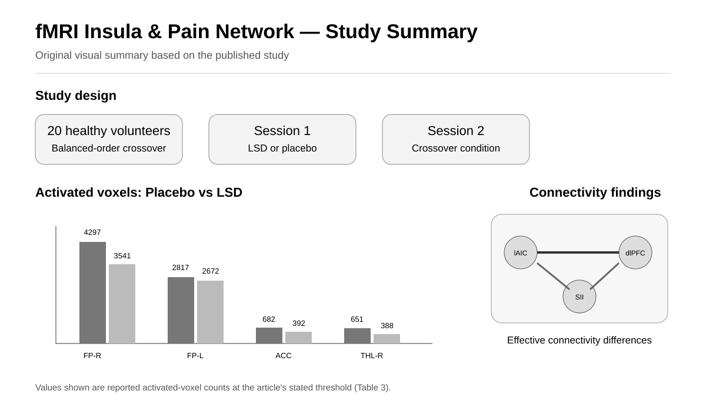

# fMRI-Insula-Brain-Connectivity

## Clinical Utility of fMRI in Evaluating of LSD Effect on Pain-Related Brain Networks in Healthy Subjects



*Original visual summary based on the published study; activated-voxel counts are taken from the reported results.*

This repository presents a research project investigating the effects of LSD on pain-related brain networks in healthy participants using functional magnetic resonance imaging (fMRI).

The study focused on changes in brain activity and connectivity associated with pain processing following LSD administration.

## Research Question

How does LSD affect pain-related brain networks and functional and effective connectivity in healthy participants?

## Study Focus

- Pain processing
- LSD
- Functional magnetic resonance imaging (fMRI)
- Pain-related brain networks
- Functional connectivity
- Effective connectivity
- Brain network analysis
- Healthy participants

## Study Design

The study included 20 healthy volunteers.

Participants underwent two fMRI sessions in a balanced-order crossover design, receiving intravenous LSD in one session and placebo in the other.

The study investigated changes in pain-related brain networks and their relationships with clinical measures of pain.

## fMRI Analysis

The fMRI data were analyzed using several complementary approaches to investigate pain-related brain networks.

The analysis included:

- Amplitude of low-frequency fluctuation (ALFF)
- Independent Component Analysis (ICA)
- Functional connectivity analysis
- Effective connectivity analysis
- Dynamic Causal Modeling (DCM)
- Correlation with clinical pain measures

## Brain Network Analysis

The study reported differences in regional activity and functional connectivity between placebo and LSD sessions. Pain-related regions included the anterior cingulate cortex, thalamus, insula, parietal operculum, and frontal pole.

Effective connectivity differences were reported for the left anterior insula cortex (lAIC) involving intra-regional connectivity and interactions with the dorsolateral prefrontal cortex, as well as for the secondary somatosensory cortex and dorsolateral prefrontal cortex.

## Reported Activated-Voxel Pattern

The placebo session showed more activated voxels than the LSD session in the reported pain-processing regions based on the ALFF analysis.

## Research Workflow

```text
Healthy Participants
        ↓
LSD / Placebo Crossover
        ↓
Pain-related fMRI
        ↓
Preprocessing
        ↓
ALFF + ICA
        ↓
Functional Connectivity
        ↓
Effective Connectivity / DCM
        ↓
Clinical Pain Correlation
        ↓
Pain-Related Brain Network Analysis
```

## Software and Tools

- MATLAB
- Independent Component Analysis (ICA)
- Functional Connectivity
- Dynamic Causal Modeling (DCM)

## Publication

Faramarzi, A., Fooladi, M., Yousef Pour, M., Khodamoradi, E., Chehreh, A., Amiri, S., Shavandi, M., & Sharini, H. (2024).

**Clinical utility of fMRI in evaluating of LSD effect on pain-related brain networks in healthy subjects.**

*Heliyon, 10*(15), e34401.

[Read the article](https://www.cell.com/heliyon/fulltext/S2405-8440(24)10432-X)

[PubMed](https://pubmed.ncbi.nlm.nih.gov/39165942/)

[DOI](https://doi.org/10.1016/j.heliyon.2024.e34401)

## Author

**Ayob Faramarzi**

Biomedical Engineering | Neuroimaging | fMRI | MRS | Brain Connectivity | Machine Learning

[Google Scholar](https://scholar.google.com/citations?hl=en&user=1uivc_4AAAAJ)

[LinkedIn](https://www.linkedin.com/in/ayob-faramarzi/)
